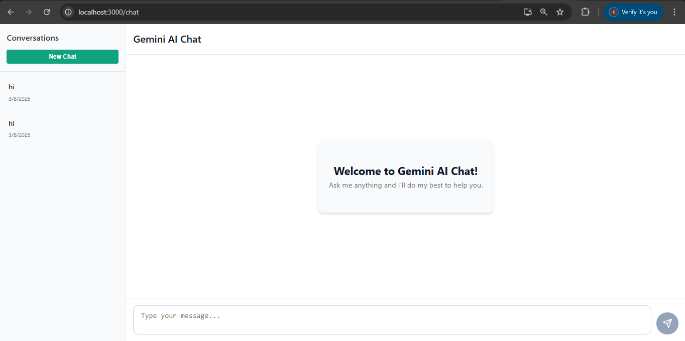

# Gemini Chat Application



A chat application using React for the frontend, Node.js for the backend, and MongoDB for storing conversation history. The application uses Google's Gemini API for generating responses.

## Features

- Modern, responsive UI similar to ChatGPT
- Conversation history storage and retrieval
- Real-time chat with Google's Gemini API
- Create and switch between different conversations

## Prerequisites

- Node.js and npm (for traditional setup)
- MongoDB (local or Atlas cloud instance)
- Google Gemini API key
- Docker and Docker Compose (for containerized setup)

## Setup Instructions

You can run this application either traditionally or using Docker.

### Option 1: Docker Setup (Recommended)

1. **Clone the repository:**
   ```
   git clone <repository-url>
   cd Gemini-Chat-Bot
   ```

2. **Set your Gemini API key** in the docker-compose.yml file:
   ```yaml
   # In docker-compose.yml
   services:
     server:
       environment:
         # Replace with your actual API key
         - GEMINI_API_KEY=your_actual_api_key_here
   ```

3. **Build and start the containers:**
   ```
   docker-compose up -d
   ```

4. **Access the application:**
   - Frontend: http://localhost (port 80)
   - Backend API: http://localhost:5000

5. **View logs for debugging:**
   ```
   docker-compose logs -f
   ```

6. **Stop the application:**
   ```
   docker-compose down
   ```

### Option 2: Traditional Setup

#### Backend Setup

1. Navigate to the server directory:
   ```
   cd Gemini-Chat-Bot/server
   ```

2. Install dependencies:
   ```
   npm install
   ```

3. Create a `.env` file in the server directory with the following variables:
   ```
   PORT=5000
   MONGODB_URI=your_mongodb_connection_string
   GEMINI_API_KEY=your_gemini_api_key
   ```

4. Start the server:
   ```
   npm run dev
   ```

#### Frontend Setup

1. Navigate to the client directory:
   ```
   cd Gemini-Chat-Bot/client
   ```

2. Install dependencies:
   ```
   npm install
   ```

3. Start the React development server:
   ```
   npm start
   ```

4. Open your browser and go to `http://localhost:3000` to use the application.

## Docker Services

When running with Docker, the application consists of three containers:

1. **MongoDB (gemini-mongo)**:
   - Database for storing chat history
   - Port: 27017
   - Data persisted in a Docker volume

2. **Backend (gemini-server)**:
   - Node.js Express server
   - Port: 5000
   - Connects to MongoDB and the Gemini API

3. **Frontend (gemini-client)**:
   - React application served via Nginx
   - Port: 80
   - Communicates with the backend API

## How to Get a Gemini API Key

1. Go to [Google AI Studio](https://aistudio.google.com/)
2. Create an account or sign in
3. Navigate to API keys section
4. Create a new API key
5. Copy the API key and paste it in your `.env` file or docker-compose.yml

## Project Structure

- `/client` - React frontend
  - `/src/components` - UI components
  - `/src/context` - React context for state management
  - `/src/pages` - Main application pages
  - `/src/utils` - Utility functions and API calls

- `/server` - Node.js backend
  - `/controllers` - Request handlers
  - `/models` - MongoDB schemas
  - `/routes` - API routes
  - `index.js` - Main entry point

## Troubleshooting Docker Setup

- If you encounter issues with MongoDB connection, check if port 27017 is already in use:
  ```
  sudo lsof -i :27017
  ```
  
- To stop any running MongoDB instance:
  ```
  sudo kill <PID>
  ```

- For detailed logs from specific containers:
  ```
  docker-compose logs server
  docker-compose logs client
  docker-compose logs mongo
  ```

- To rebuild containers after code changes:
  ```
  docker-compose up -d --build
  ```

## License

MIT
